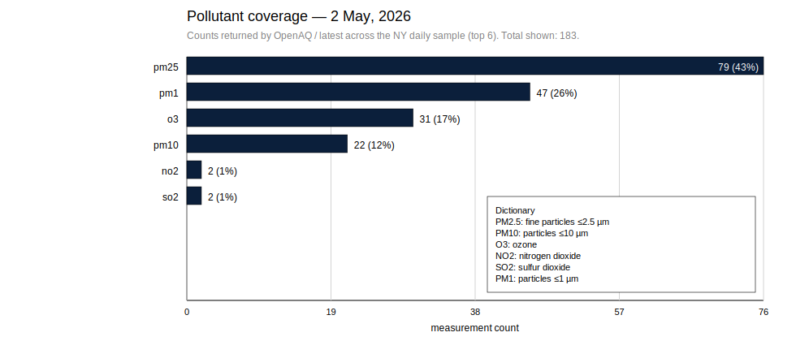

[](https://github.com/christopherbolduc/nys-air-quality/actions/workflows/daily.yml)


# NYS Air Quality (OpenAQ) — Daily Automation

This repository produces a daily, reproducible air-quality snapshot for New York State using the OpenAQ API. It filters OpenAQ locations to the NYS boundary (GeoJSON), fetches the latest readings for a stable set of NY locations, runs basic data quality checks, and writes a daily note and SVG reports.

Daily runs are automated via GitHub Actions and proposed as pull requests for human review and merge.

## Example output

**Map (latest values, colored by the selected pollutant parameter):**


**Pollutant coverage (counts + share of returned measurements, with an in-chart dictionary):**



## What it generates

For each report date (yesterday in `America/New_York`):

- `notes/YYYY-MM-DD.md`  
  A daily write-up with:
  - technical summary (counts, timings, quality checks)
  - plain-language summary
  - links to generated report artifacts

- `reports/YYYY-MM-DD/map.svg`  
  NYS map of location points colored by the selected pollutant parameter (latest value). Includes a p5–p95 legend and freshness summary (fresh vs stale vs missing).

- `reports/YYYY-MM-DD/parameter_coverage.svg`  
  Pollutant coverage chart showing which pollutant parameters were returned by `/latest` across the NY locations. Percentages represent the share of measurements in that snapshot (not severity).

- `data/daily.csv`  
  A CSV summary with one row per report date (idempotent upsert by date).

The automation opens a daily pull request so changes are reviewed and merged by a human.

## How it works (high level)

1. Fetch OpenAQ locations in a bbox covering NYS (performance hint).
2. Filter locations to those whose coordinates fall inside the NYS boundary GeoJSON.
3. Select a stable set of NY locations (deterministic; uses all available locations when the set is small).
4. Fetch `/locations/{id}/latest` with backoff to handle rate limits.
5. Normalize measurements into rows and label them using a cached sensor metadata map.
6. Compute data quality checks (e.g., stale data fraction).
7. Write daily artifacts (CSV + note + SVGs), overwriting per-day outputs.

## GitHub Actions automation

A scheduled workflow runs daily and:

- runs `python scripts/run_daily.py`
- commits generated artifacts
- opens a pull request for review/merge (human-in-the-loop)

The workflow uses a dated branch name (e.g., `automation/daily-YYYY-MM-DD`) and targets `main`.

### Secrets in GitHub

Add this repository secret:

- `OPENAQ_API_KEY`

Repo Settings → Secrets and variables → Actions → New repository secret.

### Generated artifacts

Daily notes and reports are generated in GitHub Actions and merged via pull request. The repository treats `notes/`, `reports/`, and `data/daily.csv` as build outputs produced by CI (not hand-edited).

## Artifact retention (automatic pruning)

To keep the repository readable over time, the daily job automatically removes older generated artifacts:

- `notes/YYYY-MM-DD.md`
- `reports/YYYY-MM-DD/` (daily SVG outputs)

The CSV summary (`data/daily.csv`) is retained indefinitely so longer-term trends can still be analyzed.

Retention is controlled by `RETENTION_DAYS` (default: 91). This keeps roughly a quarter’s worth of daily snapshots visible for review while preventing the repo from accumulating unlimited artifacts.

## Local setup

### Requirements
- Python 3.11+
- An OpenAQ API key
- Dependencies: `requests`, `tzdata`, `pandas`

### Install
```bash
conda activate nys-aq
python -m pip install -r requirements.txt
python -m pip install -e .
```

### Configure Secrets
Create `.env` (not committed) from `.env.example`:

```bash
cp .env.example .env
```
Set:
- `OPENAQ_API_KEY=...`

Optional configuration (via `.env` or environment variables):

- `MAP_PARAM` — OpenAQ parameter code used to color the map (defaults to the day’s most common pollutant parameter)

Optional:
- `RETENTION_DAYS` (default: 91) — delete notes/reports older than this many days

## Run locally
Default behavior generates a report for yesterday in `America/New_York`:
```bash
python scripts/run_daily.py
```
Run for a specifc date:
```bash
python scripts/run_daily.py --date YYYY-MM-DD
```

## Repository layout

- `src/nys_aq/` — production code
- `scripts/` — CLI entry points
- `notebooks/` — exploration and development (outputs should be cleared before commits)
- `data/` — NYS boundary GeoJSON, daily CSV summary, sensor metadata cache
- `notes/` — daily notes (Markdown)
- `reports/` — daily SVG artifacts

### Notes on rate limits

OpenAQ enforces rate limits. The workflow throttles requests and uses backoff to remain reliable in CI. Runs are expected to complete within a couple of minutes.

## License

This project is licensed under the MIT License. See the [`LICENSE`](LICENSE) file for details.

## Author

**Christopher Bolduc**  
[LinkedIn](https://www.linkedin.com/in/christopher-david-bolduc/) • [GitHub](https://github.com/christopherbolduc)